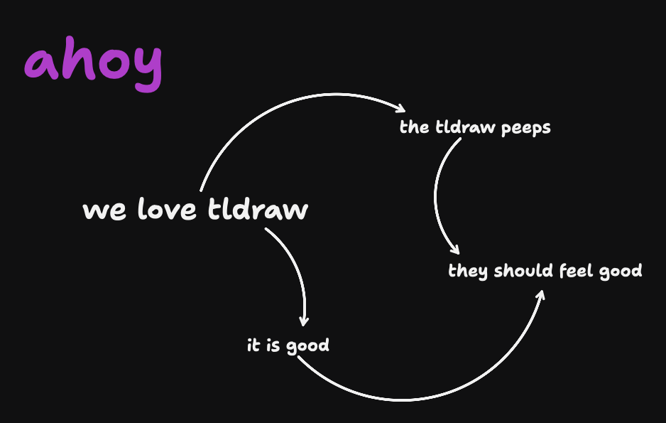

# appify-ui.tlcanvas

This is a TLCanvas document package. It is a folder that macOS shows as a single document.

## Open on macOS

Double-click this package with TLCanvas.app installed.

## Open without TLCanvas.app

- The canvas data is in `canvas.json5`.
- Large assets and editable text sidecars live under `records/`.
- `snapshot.png` is a generated preview image from the last saved TLCanvas session.
- `QuickLook/Thumbnail.png` mirrors the generated preview for macOS-style package thumbnails.

TLCanvas is built with the tldraw SDK and stores its document data as local files for portability.
